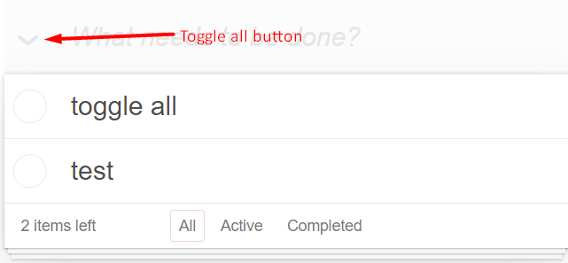

# React Todo App

- [DEMO LINK](https://BudnikOleksii.github.io/react_todo-app-with-api/)

## Description:
1. Enter your email to create a user or find an existing one in the API;
1. Loading user todos from server;
1. All the changes will be saved to the API;
1. In case of any error show the notification appear with an appropriate message;
    - you can close the notification with the `close` button;
    - it will be automatically hidden in 3 seconds;
1. Add a todo(write title and press `Enter`);
1. Toggle the `completed` status by click on checkbox for current todo;
1. Toggle the completed status of all the todos with the button.
   
1. Edit todo title on double click;
    - save changes on the form submit (just press `Enter` or click in another place);
    - cancel editing by pressing key `Ecs`;
    - if the new title is empty the todo will be deleted;
1. Filter todos by click on buttons `All` / `Active` / `Completed`
